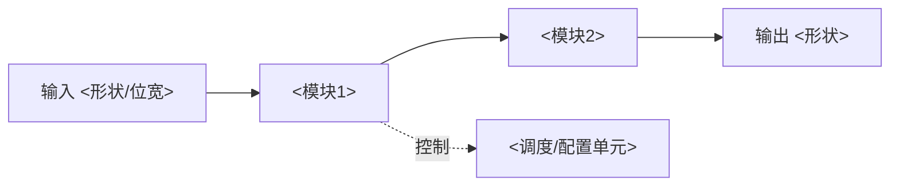

# 详细版报告模板（复制即用）

> 使用说明：把 `<...>` 全部替换；不适用的整节删除，不要留空壳。
> 每处数字后必须能指回 `30-experiments.md` 或 `20-claims.md` 的条目 ID；每处判断带 `[推断]` / `[待核实]` / `[论文未给出]` 标记者除外，其余视为已证实。
> 引文一律 `> "原文英文句子"（§节号 / p.页码 / Table n）`。
> 写完后从本文件抽两份更短的：**简略版**（见 `brief-template.md`，带判断）与**摘录版**
> （见 `notes-template.md`，去判断、不评级）。三版 md 都放 `reports/`，再调 `paper_docx` 一次出三份 Word。

<!-- meta: {"title": "<论文标题> 分析报告", "subtitle": "详细版", "author": "<姓名>", "date": "<YYYY-MM-DD>", "paper": "<论文标题>\n<期刊/会议> <年份>", "source": "详细版 · 论文分析模式", "version_label": "detail"} -->

---

> 下面是正文。**不要再写一级标题的论文题目**——题目、作者、日期已经由上面的 meta 渲染到封面，
> 正文从二级标题开始（`## 1. 摘要卡`），这样 Word 目录才干净。

**材料**：<PDF/链接/来源> ｜ **出处**：<期刊/会议> <年份>，DOI/arXiv：<ID>
**一句话定性**：<这篇论文是"在某约束下把某指标推到某水平"型工作，证据等级 X>

---

---

## 1. 摘要卡（2 分钟版）

| 项 | 内容 |
|---|---|
| 问题 | <一句话> |
| 已有做法的瓶颈 | <一句话，含具体代价：面积/能耗/精度/收敛速度> |
| 核心方法 | <3 个构件，逗号分隔> |
| 最强结果 | <原始数字 + 条件：在 <工艺/数据集> 上，<指标> 从 <A> 到 <B>> |
| 证据等级 | 实测 / post-layout 仿真 / RTL 仿真 / 理想模型 / 仅理论 |
| 创新点等级 | <A/B/C/D 级 × n 条，逐条一句话> |
| 复现难度 | 低 / 中 / 高 —— 卡点在 <数据/工艺/算力/私有工具> |
| **我的结论** | <是否值得跟进、跟进哪个点、最大风险是什么> |
| 最该问作者的问题 | <1–3 条> |

---

## 2. 问题与动机

### 2.1 问题定义
<用不含评价性形容词的句子复述问题。写清输入、输出、约束、优化目标。>

### 2.2 问题定义矩阵

| 维度 | 内容 |
|---|---|
| 输入 | <数据类型/规模/位宽> |
| 输出 | <目标指标> |
| 约束 | <面积/功耗/时延/精度/成本/可解释性> |
| 优化目标 | <单目标/多目标；若有加权，权重从哪来> |
| 评价场景 | <基准/用例/工艺节点> |
| 隐含假设 | <作者未声明但被用到的假设> |

### 2.3 作者声称的 gap
> "..."（§I）

**我的判定**：这个 gap 属于 <能力缺口 / 成本缺口 / 评估缺口>。它是否真实？`[推断]` <依据>。

---

## 3. 方法重构

### 3.1 结构图

### 3.2 符号表

| 符号 | 含义 | 量纲/取值范围 |
|---|---|---|
| <x> | <含义> | <...> |

### 3.3 核心机制逐步走一遍
<用具体数值走一遍前向过程，让读者相信你真的看懂了。标注每一步来自原文哪一段。>

### 3.4 复现关键参数

| 参数 | 值 | 来源 |
|---|---|---|
| 工艺节点 / 数据集 / 模型规模 | <...> | §<n> / 附录 |

---

## 4. 技术分解与创新点

### 4.1 构件清单

| 构件 | 状态 | 说明 |
|---|---|---|
| <构件1> | 已知 / 已知但改造 / 新提出 | <一句话> |

### 4.2 创新点 1：<标题>
- **相对基线差异**：<与"自报最近邻 / 同期同类 / 经典母题"的具体差异>
- **为什么算新**：<...>
- **支撑证据**：<表/图 + 数值>
- **分级**：<A/B/C/D> —— <一句话理由>
- **可证伪表述**：若 <对照实验> 显示 <反例>，降为 <级别>

### 4.3 创新点 2：<标题>
<同上>

### 4.4 创新点总结表

| # | 创新点 | 相对谁新 | 证据 | 等级 | 我的信心 |
|---|---|---|---|---|---|
| 1 | | | | | 高/中/低 |

---

## 5. 实验方法与结果解读

### 5.1 实验设计判定

| 判定项 | 结论 | 依据 |
|---|---|---|
| 基线是否公平 | 是/部分/否 | <基线复现条件> |
| 消融是否充分 | 是/部分/否 | <缺哪一组> |
| 是否给方差/多次运行 | 是/否 | <位置> |
| 指标是否选择性报告 | 是/否 | <哪些指标缺> |
| 是否含开销/扩展性 | 是/否 | <...> |
| 结论是否超出数据范围 | 是/否 | <外推点> |

### 5.2 主结果（原文数字）

| <指标> | 本方法 | <基线A> | <基线B> | Δ | 相对提升 | 原文位置 |
|---|---|---|---|---|---|---|
| | | | | | | Table <n> |

**我的解读**：<数据支持到什么程度；还缺什么对照才能坐实。>

### 5.3 消融与敏感性
<照抄关键消融行的数值，并指出消融设计的问题（如只做删除式消融）。>

### 5.4 开销与代价
<时间/面积/功耗/内存/工具链成本。本方法在哪些维度上是"用 A 换 B">。

---

## 6. 局限与风险

### 6.1 作者承认的局限
> "..."（§<n>）

### 6.2 我发现的局限
| ID | 局限 | 严重度 | 证据/缺失点 | 怎么才能补上 |
|---|---|---|---|---|
| L1 | | 高/中/低 | | |

### 6.3 若结论为假，最先在哪里崩
<一句话指出最脆弱的那一环。>

---

## 7. 与相关工作的关系

<若只分析单篇，保留 3–5 条最相关的对比；若多篇，改用 `compare-template.md` 的矩阵。>

| 工作 | 年份 | 关系 | 差异要点 | 是否被本文超越 |
|---|---|---|---|---|

---

## 8. 对我的研究

### 8.1 可复现路线
1. <最小复现目标（先跑通哪一块）>
2. <数据/工具从哪来>
3. <卡点与预估工作量>

### 8.2 可切入的创新机会
| 机会 | 依据（论文的哪个局限） | 预期收益 | 难度 | 需要什么资源 |
|---|---|---|---|---|

### 8.3 待澄清问题（可直接发给作者/导师）
1. <...>

### 8.4 引用信息
<BibTeX / GB/T 7714 两种格式各一份>
